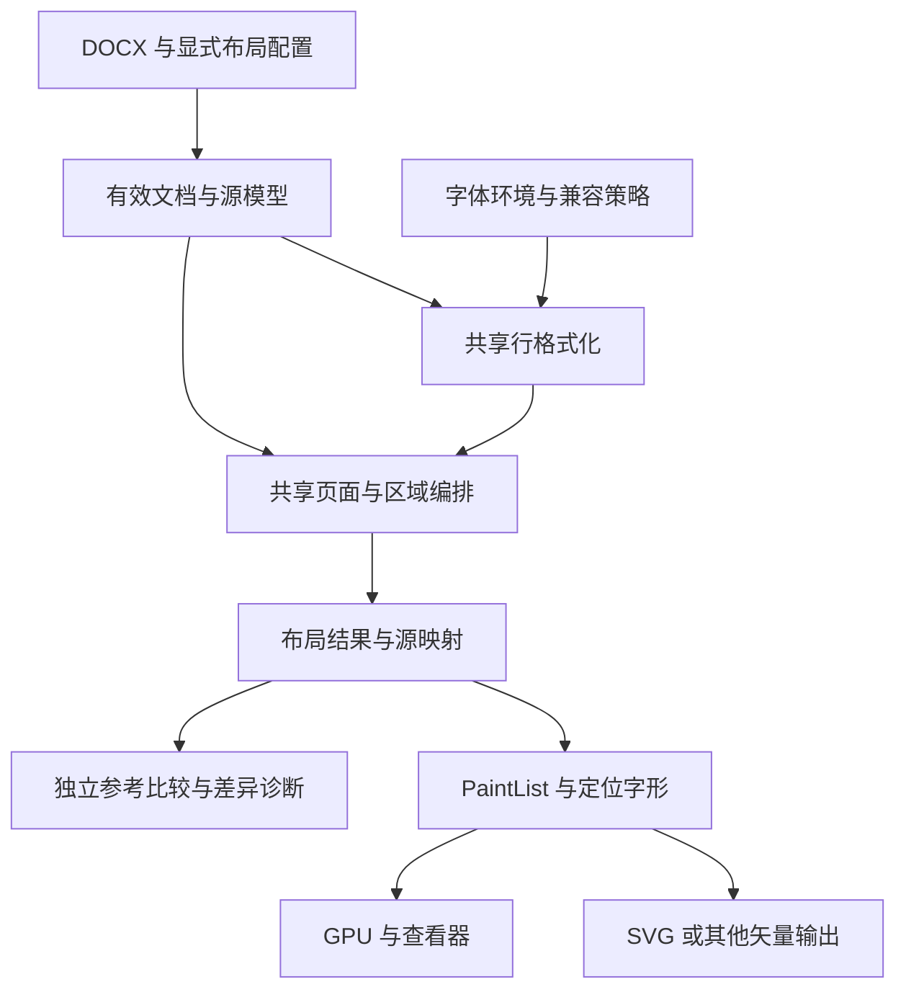

# rsWordLayout 北极星与开发规划

更新日期：2026-09-27。代码基线：`1a3c6ba8d6917033cb25f56061023af44b5fbe3c`。
本文给出目标、优先级和阶段出口；它是开发规划，不是已完成能力声明或工期承诺。
长期 goal 仍暂停，本次规划不启动实现、Word 采集或自动续跑。

## 1. 北极星

**给定 DOCX、确定的字体和兼容配置，用一套 Rust 内核生成可复现、可追溯的行、页和
字形位置；在明确支持的文档范围内，与指定 Word 平台及版本的真实输出一致。**

对使用者，这意味着同一文档在原生应用和浏览器中有相同的分页依据，预览与导出消费
同一份布局结果；发生差异时，能定位到输入、断行、行高、页面容纳或绘制的具体环节。

最先交付的产品是**可嵌入的只读 DOCX 排版内核与参考查看器**。核心价值是完整显示
承诺范围内的内容、正确分页、稳定输出和可解释诊断。编辑器、协同编辑和任意复杂
DOCX 的全面兼容不作为首版前提。

近期最重要的判断标准是：**有多少预先登记的完整文档，已经能被正确布局并严格复验。**
提交数、逆向函数数、测试数和“已经有这个类”都只是工程信息。

## 2. 成功如何衡量

### 2.1 文档是验收单位

一个验收用例由文档和配置共同定义。相同 DOCX 的 Mac print、Android mobile 和
Android print 是不同用例，不能混算。配置至少绑定：文档哈希、目标 Word 版本、
视图、实际页面/区域、兼容选项、字体文件与 face index、字体回退次序、源坐标域和单位。
引擎执行另绑定代码版本、构建特性、依赖和输出。

严格通过的文档必须同时满足以下条件。只有文档确实不含某类内容时才可事先标为
不适用；缺少参考、无法绑定或无法测量必须保留不可判。局部合同通过单独计数，
不能靠免除几何或字体检查进入严格整文档分子：

| 维度 | 通过条件 | 不能替代它的结果 |
| --- | --- | --- |
| 内容完整 | 声明支持的正文、表格和 story 全部有归属；隐藏内容保留源位置；没有无提示丢失 | 页数相同、截图大致相似 |
| 源身份与断行 | 按读序比较完整 UTF-16 源区间、控制符及行身份；无丢失、重复、乱序 | 只比较行起点、共有前缀或引擎自己重建的两份 run |
| 分页与区域 | 每个源行的页、栏、表格行/格归属一致；页数和读序一致 | 只比总页数 |
| 几何 | 在可独立配对的范围，字形原点、推进量及可测框满足预先固定的精度合同 | 用一个拟合平移量消掉整页误差 |
| 字体与绘制 | 可测范围内实际 face/字形身份正确；后端忠实消费布局结果 | 浏览器再次整形后恰好看起来相近 |
| 可复验 | 原始参考有效，输入和环境可核对，重跑得到同一结论 | 单次成功截图、报告中的一行页数 |

结构维度要求精确相等。几何容差须先由对应测量通道的量化和重复性确定，再冻结；
不同通道分别规定，不设一个万能的“接近 Word”阈值，不根据候选误差反调容差。
未绑定到真实 Word 的内部行盒不能冒充可测参考量。

### 2.2 一个主指标，三组护栏

北极星指标为 **严格整文档通过数 / 固定验收集用例数**，按功能族和平台配置分别报告。
分母包含尚未通过、暂不支持和参考待补的已登记用例，不能通过排除难例提高分数。
参考待补不等于引擎失败，但同样不能贡献严格通过数。

同时展示以下护栏，避免一个百分比掩盖原因：

| 护栏 | 应报告的内容 |
| --- | --- |
| 能力覆盖 | 完整支持、部分支持且有诊断、不支持三类数量；所有遗漏的可见内容单列 |
| 证据覆盖 | 可严格判定、仅条件可判、缺参考/参考无效的数量；缺字体身份与缺页行读数分开 |
| 稳定性 | 对已有通过集的新增退化数、跨入口结果差异、运行失败、耗时和内存分布 |

功能族至少分为正文断行、纵向/分页、分节多栏、表格、页眉页脚/编号、对象、脚注。
按族展示，不让大量简单拉丁段落淹没少数难例。任何发布必须保持已承诺功能族零新增退化。

新指标面板尚未实现，也尚未按此定义统计当前覆盖率。不得把下节已有历史回放数字
直接填成全项目兼容率。后续调整验收集需显式升版，同时保留旧分母的比较结果。
长期目标集可以包含未实现能力；每版另在开发前冻结所承诺的发布集。发布集要求全部
满足合同，不能在发布前临时移除失败用例；长期面板仍保留这些用例。

## 3. 当前真实起点

| 领域 | 当前能力 | 尚未完成的关键部分 |
| --- | --- | --- |
| 输入与源流 | 有效属性、节几何、UTF-16 源区间、隐藏文字、部分兼容项 | 多 story 身份、完整表格样式层、部分 mark 与宿主默认行为 |
| LS 对应职责 | 真实字体与回退、整形、禁则、制表位、字距、大小写、跨 run 回退及自动间距一致性 | 混合字号自动间距实测、完整 bidi/复杂文种、完整两端对齐槽策略 |
| PTS 对应职责 | 页面/栏续排、keep/widow、段距折叠、镜像边距、受限连续分节平衡 | exact 首原点、部分字体自然高度、docGrid、容量相关尾部裁减、复杂连续节 |
| 表格 | 单格行、显式 exact 行高、零左右 cell margin、无可见边框的真实正文与行边界续排 | 多格、内容决定行高、样式/边框/边距、行内拆分、重复表头、与 keep/栏平衡组合 |
| 绘制 | PaintList；SVG 可选择近似文字与定位轮廓两种模式；GPU 等后端框架 | GPU 字形横向比例及图形状态/裁剪尚未消费，通用路径绘制有限；跨后端完整验收待补 |
| 嵌入入口 | Rust、C ABI、WASM 会话和多个渲染后端 | C ABI/WASM 构建会话仍固定 SimpleMetrics；诊断和字体生命周期合同不统一 |
| 多 story/对象 | 部分锚定环绕几何；控制与对象占位源记录 | 脚注、页眉页脚占位、编号正文外标记、完整图片/浮动对象布局与绘制 |

实现范围以源码和对应专题为准。尤其“支持 exact”表示有实现路径，不表示已解决
真实 Word 的 exact 首原点反例；“表格已接入”也只代表上述严格受限形状。

最近三个有代表性的验收记录：

- [自动间距一致性](AUTOSPACE-CONSISTENCY-2026-09-27.md)：`9fd8948` 的 Android
  11 份条件回放为 186/186 行区间；不能证明所有平台的字形几何或打印分页。
- [SVG 定位输出](SVG-POSITIONING-2026-09-27.md)：`e1c1a47` 的 14 个浏览器样例
  验证 57 个字形与 65 项断言；这是后端消费验证，不是 Word 输出一致性。
- [首个表格切片](TABLE-FLOW-2026-09-27.md)：`1a3c6ba` 的真实 cell 正文、行框和
  源续排已落地；Mac 25 份非表格轨迹保持不变，30 包仍为 23 FAIL / 7 UNDECIDABLE / 0 OK。

测试数字必须附命令和特性集。表格片记录的 741 passed / 13 ignored 使用
`--features rsword-layout-core/fontenv`；SVG 片的 740 passed / 12 ignored 使用
`--features fontenv`。不能据两个总数直接计算新增测试数量或推导特性覆盖相同。

## 4. 首版承诺与延后范围

建议将首版拆为两个可独立交付的承诺，避免把所有特性等到最后才形成产品。

| 交付 | 承诺范围 | 发布要求 |
| --- | --- | --- |
| A：文本与基础表格预览内核 | 指定字体的中英混排；段落/分页/常用分节；固定布局、显式列宽、无合并的基础表格；定位矢量预览 | 对外列出支持形状；承诺范围内容完整；对应固定验收集严格通过；原生与浏览器采用同一输入合同 |
| B：常用业务文档内核 | 在 A 上增加页眉页脚、基础编号、行内图片、常用表格边距/边框/标题行；脚注作为后续独立能力包 | 真实复合文档通过；单项能力与组合行为都有参考；缺失特性不能静默消失 |

A 的 docGrid、exact 和复杂字体仅能在已验证配置下承诺一致性。若纵向关键路径尚未
闭合，可发布明确标注限制的工程预览版，不能称为严格兼容版本。

首版不追求所有 Word 版本、全部 OpenType 特性、任意复杂脚本、嵌套合并表格、
文本框链、公式与修订显示的完全兼容，也不预建编辑器。Windows、Android、Mac
分别取得验收；共享源码只减少重复实现，不替代平台验证。

PDF 导出可在布局合同稳定后作为消费者加入；当前 README 中的 PDF 设计方向不等于
已经存在经过验证的独立 PDF 导出后端。交互命中、选择和增量排版在全量布局稳定后推进。

## 5. 目标架构

沿用现有模块和 Interface，逐片加深能力；不按逆向对象偏移复制 PTS 类层次。
只有出现真实的第二个调用方或实现变化，才提取新的 Seam。

| Module | Interface 应封装的事实 | 现有接入点与下一步 |
| --- | --- | --- |
| 有效文档与源模型 | 声明值与有效值、有序块、源身份、兼容项、缺省来源、遗漏诊断 | `load.rs`、`bridge.rs`、`document.rs`、`table.rs`；扩展 story 时引入 part/story 身份，不能共享裸 node id |
| 字体环境 | 字体字节/index、回退顺序、字号精度、度量与整形一致性 | `font/*`、FontRegistry、RealMetrics；将同一环境贯穿会话生命周期 |
| 行格式化 | 在区域宽度与源游标上生成下一候选行，保留断点、源簇和未决垂直量 | `layout.rs`、LineCursor、PendingLine；把行内算法集中在这里 |
| 区域编排 | 对容量求决、接受或重试、保留约束、表格行/脚注预留、跨页跨栏续排 | `layout/pagination.rs`、`flow.rs`、`vertical.rs`；预检和提交共用已决记录 |
| 布局结果 | 页/栏/row/cell 身份、源区间、几何、字形、诊断、输入指纹 | Page、TableRowBox、PaintList、oracle；逐步稳定版本化合同 |
| 宿主 Adapter | 字体与配置注入、资源所有权、错误/诊断、结果访问 | SVG CLI、C ABI、WASM；禁止布局后再换一套不匹配的 shaper |

源范围、页面/栏归属与几何是共享结果，后端不能重新选择断点和字体。近似文字输出
可以继续存在，但必须明确模式，不能进入精确模式验收。

关键不变量：换页/换栏仍前进；回退不丢源字符；同样有效属性的 run 拆分不改变布局；
容量变化重新求决；预排与实际提交一致；表格和脚注不能通过拼接普通段落伪装；
物理页、移动容器、DOCX docGrid 和宿主坐标量化分别建模。

会话持有固定字体快照/指纹、fallback 次序和度量策略。字体改变须使布局失效并重排，
或拒绝与旧结果混用。当前 WebGL `render_page` 才接收 FontSet，故只增加注册字体参数
还不够。GPU 的几何消费也独立验收：同一 PaintList 不保证现有每个后端已忠实绘制。

现有表格以 `paras + tables.before_para` 编排，含表格的栏带关闭平衡重放。
在行内拆分、复杂 keep 和表格栏平衡之前，必须定义可恢复的 block/row/cell 游标，
让 trial 与 commit 走同一路径。可先保留受限多格 exact 行，不需提前建成完整结构流框架。

## 6. 阶段路线与退出条件

阶段按依赖推进，不按日期假定未知问题已经解决。表格功能与纵向研究可并行，
共享分页器改动由单一负责人集成；两个方向都不等待“完整逆向 Word”完成。

| 阶段 | 核心交付 | 依赖 | 退出条件 |
| --- | --- | --- | --- |
| M0：可判定基线 | 固定验收集、配置记录、能力矩阵、分层差异摘要、性能初始基线 | 当前代码与既有证据 | 每例有支持状态和证据状态；严格/条件/未知不能混分；能复验当前已知失败 |
| M1：共享真实入口 | 一份显式字体/配置的会话构建路径，CLI、C ABI、WASM 顺序接入 | M0 | 相同输入的布局结构、源区间与字形几何一致；字体变化触发重排或拒绝；诊断不丢失 |
| M2：纵向与分页闭合 | 一个受限真实字体配置下的自然高度、exact 原点、docGrid 与页末容纳规则，分开提交 | M0；运行输入绑定 | 正向、反例和留出用例均通过；推进与 required 分开；keep/widow/栏平衡消费同一已决结果 |
| M3：基础表格可用 | 先固定布局、显式列宽多格 exact 行；再结构续排、内容行高、边距/边框；先不合并/嵌套 | M0；现有表格片；内容行高需适用纵向合同 | 真实 cell 内容与身份完整；表前后源范围连续；试排/提交不丢内容；新增 Word 表格参考可核验 |
| M4：常用文档组合 | 编号、页眉页脚、行内图片、复杂分节中的明确子集；每项独立发布 | M1；多 story 身份先行 | 组合文档严格通过；独立 story 不污染主文 CP；生成标记有身份；对象宽高参与真实布局 |
| M5：动态页面内容 | 脚注、续注、可拆表格行、重复表头与相关 keep/平衡交互 | M2、M3；M4 的源模型 | 引用行与注释预留共同提交/回退；无丢失、重复、死循环；跨页续排有独立参考 |
| M6：可分发与性能 | 可复现构建、Native/WASM 验收、版本化输入/输出、性能预算、可选命中/选择与增量 | M1；拟发布功能组合稳定 | 干净环境可构建；资源生命周期可验；跨端一致；性能达已冻结预算；增量结果等于全量重排 |

M1 不要求先解决所有 Word 几何差异，它解决不同宿主是否在使用同一套真实计算。
M2 必须拆成有具体输入和可验证输出的多片；不能以“实现所有垂直公式”为单张任务。
M3 可先交付工程能力，严格 Word 表格几何验收独立标记；不能让未知字体高度阻塞所有
表格开发，也不能据已实现表格反向宣称 M2 完成。M6 的构建与资源检查从 M1 开始积累。
GPU 缩放、状态与裁剪须在承诺表格溢出裁切或对象跨后端一致之前完成；跨入口布局一致
与跨后端绘制一致分别设检查，不因前者通过就勾选后者。

M2 的默认推进顺序为：

| 子阶段 | 复用材料 | 退出条件 |
| --- | --- | --- |
| Exact 原点 | 已有 12 份规范输入及实际原点比较 | 同一候选解释 body/mark 独立字号、Arial、exact218/480/481、top721、软回车、空首段；再通过事先声明的独立判别样本 |
| docGrid 原点与推进 | 21 份网格输入与 6 份 pitch 阈值输入 | 完整原点向量及源行归属符合合同，尤其解释 pitch275/276 的步长切换，不能只匹配平均步长 |
| Page-fit 占高 | 16 份页面容纳输入 | 完整源页归属符合合同，包含指定 TNR12、pitch360、12 段输入在 DOCX 配置正文高度 4277 twips 时为 11+1、4278 twips 时为 12；保持无网格对照及 keep/硬断/栏回归 |

这些数值是指定夹具的判别约束，不是生产常数。两份容量探针的 PDF 页高相同，不能
从 MediaBox 反推上述配置高度或内部 limit。固定 S=300 的简化 exact 候选已有反例；
若其余 tuple、tag、参数及路径相同，而且 pitch 没有额外上游/下游用途，将
pitch275/276 预先截成同一内部值就不能解释其不同输出。这只排除该简化候选。
12×360 也不能直接当作 12 行必需占高。先让同一候选接受这些联合约束，再追加少量采集。
已有自适应探索样例不能事后改名为独立盲测。

## 7. 下一批可执行任务

下表是本地规划，不代表已创建工单或已启动工作。恢复后先做 R01，再推进 R02/R03；
纵向负责人并行做 R04，表格负责人准备 R07 的真实输入。每片完成后及时 commit。

| ID | 优先级 | 具体任务 | 完成判据 | 依赖 |
| --- | --- | --- | --- | --- |
| R01 | P0 | 登记现有验收用例与支持/证据矩阵，绑定当前基线 | 版本化用例清单与可重生成面板；复现 Mac 历史状态及 Android 条件状态；每项失败有归属 | 无 |
| R02 | P0 | 从现有 SVG outlines 管线提取共享真实字体会话，并立即由入口消费 | 复用已有度量/整形/输出链路；同一字体环境；保持旧入口兼容；字体失败和遗漏诊断可见 | R01 |
| R03 | P0 | C ABI、WASM 逐个采用同一构建合同 | 真实 DOCX 的规范化布局结果与 Rust 一致；覆盖隐藏内容、回退、表格和错误；不只数页数 | R02 |
| R04 | P0 | 选定 canonical exact 的一个候选合同，列出现有绑定和唯一下一缺口 | 用全部 12 例报告最早分歧；闭合该候选实际依赖的一个输入，或以反例排除候选；其余未知保持显式 | R01 |
| R05 | P0 | 建立容量求决结果到实际放置的统一通路 | 默认行为回归不变；候选容量变化重新求决；预检/提交相同；不默认开启未知尾部规则 | R04 明确所需数据合同 |
| R06 | P0 | 逐条接入已证的 exact / docGrid / 页末规则 | 每片都有实际输入、独立留出反例、完整源页归属与坐标验收；无拟合全局常数 | R04、涉及容量时 R05 |
| R07 | P1 | 固定布局的显式 tblGrid 多列、exact 行高、无合并格 | 明确 tblW/grid/tcW 的可接受关系，首片拒绝冲突及 autoFit；各格独立断行；完整标签、行框、尾段和整行续排；多格源投影独立核验 | R01、现有表格片 |
| R08 | P1 | 可恢复结构游标与统一试排/提交 | 不等宽栏、部分栏带、keep 回退都不丢段落或表格内容；保留当前不支持诊断直到通过 | R07；容量相关部分 R05 |
| R09 | P1 | auto/atLeast 行高、cell margins、边框和 exact 溢出逐片接入 | 内容决定高度；真实 Word 区分撑高/裁切/溢出；绘制实际边框；不能沿用未测的默认值 | R08；适用纵向合同；裁剪依赖 R14 |
| R10 | P1 | part/story 源身份和生成内容身份 | 多个 part 的 node id 不碰撞；编号等无原文字符内容不伪造主文 CP | R01 |
| R11 | P1 | 编号、页眉页脚、行内图片分别做最小贯通片 | 装载到实际绘制；占位参与分页/断行；明确有限支持；有真实复合文档 | R10、M1 |
| R12 | P2 | 首个脚注引用行与 note story 动态预留 | 主文/脚注一起容纳或重试；separator 和 note 独立度量；不扣固定拟合值 | R05、R10 |
| R13 | P2 | 构建移植、字体缓存、性能和增量原型 | 先测量热点；跨入口一致；优化不变更布局结果；增量对照全量 | M1、拟优化路径稳定 |
| R14 | P0 | GPU 横向缩放、图形状态与裁剪逐片接通；通用曲线路径另片扩展 | 固定 PaintList 的实际几何与 SVG 参考合同一致；不支持命令明确报告；不要求不同光栅器像素完全相同 | 既有 SVG 定位合同；可与 R02 并行 |
| R15 | P1 | 重复表头、可拆行及表格 keep/栏平衡组合 | 试排和提交一致；重复内容带实例身份；跨页/栏无丢失、错误重复或死循环 | R08、R09；复杂容纳 R05 |

R04 的首选判别材料已存在，先复用
[规范 exact 反例](EXACT-VERTICAL-EVIDENCE-2026-09-27.md)、
[docGrid 页容量](DOCGRID-PAGE-FIT-2026-09-27.md)和
[普通分量合同](DOCGRID-PLAIN-COMPONENTS-2026-09-27.md)。
R05 直接参考 [Simple 容纳接入约束](SIMPLE-FIT-REFERENCE-2026-09-27.md)。
R07 至 R09 从 [表格当前合同与拒绝条件](TABLE-FLOW-2026-09-27.md)出发，
不要重新实现已经提交的单格 exact 行。

R01 每例至少保存 case ID、合同、支持/证据状态、比较器及结果绑定，按 case ID
去重，功能族标签可以重叠。R04 每轮只追必要的一项输入；provider、请求单位、尺度、
E/q 和活动分支是后续按候选需要分别闭合的清单，不是一次任务必须穷尽的前置条件。
exact 候选不依赖的 E/q 问题留给对应网格或容量任务。

在 R02/R03 同时核对所有入口的“有可布局内容”判据，避免仅用 `paras.is_empty()`
代表未来结构文档是否为空；保留缺尾段等输入诊断，不在入口偷偷修复 Word 文档。
现有 `../docx-layout` 本机路径依赖也需进入构建清单；不能等发布时才发现外部源码未固定。

## 8. 研究如何服务开发

静态分析用于提出可判别问题和定位输入/分支，真实 Word 用于裁决输出，工程测试用于
防回归。三者都需要，但任何一个都不能代替另两个。

每个研究任务开始前写清：要排除的假设、最少输入、观测量、如何改变下一片实现，
以及完成或停止的条件。每轮最多解决一个核心歧义，例如 E 是否参与、实际字号单位、
页末裁减是否改变推进。已有原始证据先离线复核，再决定是否需要新的采集。

建议采用以下工作节奏，作为后续执行约束：

- 同时最多一片共享分页器修改；其它负责人做只读审计、独立比较或不相交模块。
- 研究连续两轮没有缩小候选或改变工程决策，就记录确切缺失输入与恢复条件，转做
  有明确合同的功能片；不要继续扩大反汇编范围来代替决策。
- 锁屏或采集不可用时保留任务状态，继续不依赖新 Word 读数的开发，不填补未知常数。
- 一片的产物必须是用户可见能力、可复验规则、明确反例，或关闭一个阻塞；重复证明
  已知事实不是新的里程碑。
- 审计强度与风险匹配。复用既有冻结包和脚本；没有新改动或新风险就不重复跑全部
  字体实验、生成器和平台采集。

`../word_analyse` 继续作为外部只读证据源。其报告、静态函数名、原始日志和本项目
生产验收分别标记。语义不确定的字段不因名称熟悉就进入通用算法。

## 9. 验证与发布规则

每片记录问题、输入、改动范围、通过条件、未测范围和提交。实现测试走真实公开
管线；只验证私有 helper 的算术，不能作为 DOCX 到页面行为的唯一验收。

| 变更范围 | 必须覆盖 |
| --- | --- |
| 文档/源模型 | 真实 DOCX 装载，有效属性、控制符、非 BMP、隐藏源区间、遗漏诊断 |
| 断行/整形 | 实际源区间与 glyph；等价 run 拆分；字体回退；既有 Android 行边界护栏 |
| 纵向/分页 | 恰好放下与相邻阈值，keep/widow、换栏/重排、实际提交推进；Mac 基线差异分类 |
| 表格/story | 真实内容、row/cell/story 身份、换页续排、完整性；明确未验证的 Word 语义 |
| 输出/绑定 | 同一 PaintList 的几何和字体消费；模式错误及资源生命周期；必要的真实浏览器/原生检查 |

验收集分开发集与留出集：同一个文档的轻微变体应归同组，避免把同构夹具当独立
泛化证明。每个承诺功能族至少有正例、边界、反例及与另一功能组合的留出例。
参考无效时保留不可判和原因，不按引擎结果修正参考。跨平台发布分别完成这些条件。

源码、边界夹具、比较器和文档提交 Git；体积较大的原始采集和二进制放冻结证据包。
记录来源与哈希，不改历史结果。已有 strict 通过不能退化；已有失败可以作为已知
限制保留，但不能计为新功能通过，也不能通过放宽比较器“修复”。

## 10. 性能与交互的推进条件

M0 先建立 1/10/100/1000 页量级、正文/表格/混排三类文档的可重复基准，区分冷启动、
字体缓存后重排、单页绘制；记录硬件、构建模式、耗时分布、峰值内存和字体缓存规模。
当前没有足以支持全项目耗时或内存承诺的统一基线，因此本文不虚构毫秒目标。
基线完成后，在优化开始前冻结拟发布设备和预算，并把回归阈值加入发布检查。

优化顺序是测量热点、缓存稳定输入、避免重复整形/试排，再评估增量布局。
增量接缝应保留源游标、区域、字体/属性依赖和失效范围；其首要判据是结果与全量
排版一致。没有这个对照前，不将局部重排速度作为产品能力。

命中、选择与可访问文本需要源簇到几何的映射，不能依赖 SVG 轮廓自带文本语义。
此能力可独立增加；不得为支持选择而让浏览器重新决定字形位置。

## 11. 主要风险与决策

| 风险 | 对规划的影响 | 决策 |
| --- | --- | --- |
| 相同 PTS/LS 家族但输入或宿主不同 | 一套实现仍可能需要多个兼容策略 | 先绑定实际差异输入，再增加局部策略，不分叉整套引擎 |
| 行高看似吻合但页容量错误 | 累积误差或 required/advance 混用 | 基线、推进、容纳和显示量分别验证 |
| 实现快速增长、真实参考增长慢 | 功能表膨胀但严格覆盖率停滞 | 能力与证据双状态；每个里程碑补真实复合参考 |
| 表格/脚注导致源身份与回退失真 | 丢内容或页数碰巧相同 | 结构身份先行，共同提交/重试，禁止占位拟合 |
| 入口度量不一致 | 浏览器、CLI、原生同文不同页 | M1 提前完成共享字体生命周期和会话合同 |
| 只在同机构建成功 | 本地路径依赖、字体和系统条件未固定 | 建立外部源码清单；在干净环境复建并区分可分发字体 |
| 未知规则长期占据全部精力 | 有证据却没有可用引擎 | 两轮研究停止规则，主线持续交付有限但完整的功能 |

## 12. 执行入口与文档分工

本文是目标和优先级入口；[共享 PTS/LS 开发记录](SHARED-PTS-LS-DEVELOPMENT-2026-09-27.md)
保存具体接缝、历史进展和已有命令。各专题负责自己的输入与证据，冻结 artifact 负责
原始执行记录。历史 handoff 只代表交接时状态，不覆盖后续提交，例如已有表格片。

恢复开发时默认从 R01 开始，以“共享真实入口 + 一个有明确合同的表格扩展”为功能主线，
并行闭合 R04 的单个纵向问题。第一轮结束应交付：一份诚实的验收面板、可复验的当前
基线，以及下一片可以直接实施的输入和出口。随后按阶段门槛推进，不再另起一套总路线。
